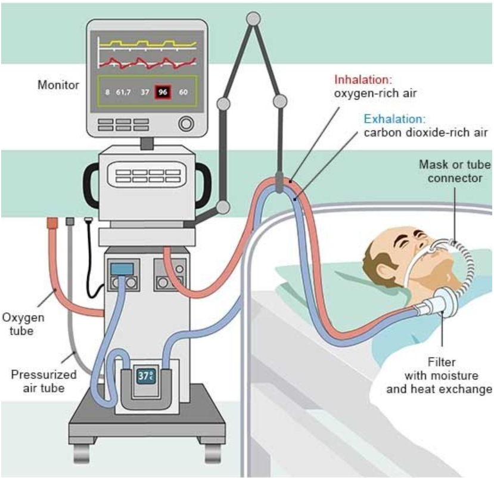

# Ventilator Pressure Prediction

- **General Information and Goal:**
  Mechanical ventilators play a critical role in supporting patients with respiratory difficulties, such as those suffering from COVID-19 or other 
  lung-related conditions.The primary objective is to make accurate predictions for the air pressure delivered by mechanical ventilators to 
  patients leveraging historical data. Precise air pressure regulation is vital for individuals in need of ventilator support, and improved 
  predictions can potentially enhance treatment and save lives.
- **Dataset:** [Ventilator Pressure Dataset](https://www.kaggle.com/competitions/ventilator-pressure-prediction/overview)
- **Type of Task:** Here the values of different time series is used to predict the values of other series. So this is a regression task.
- **The Notebook:** In the notebook, I begin with data loading and data overview followed by some analysis and feature engineering. The final 
  dataset is then used in a simple LSTM model to predict pressure with the metric being Mean Absolute Error.

